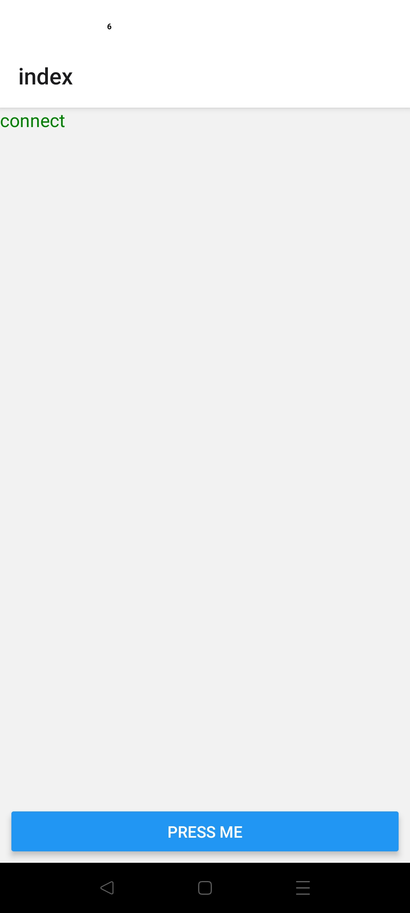
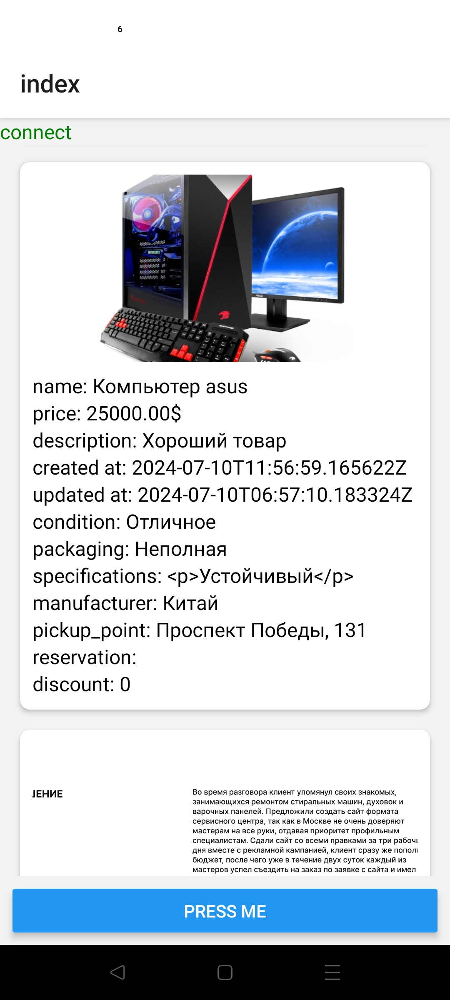

# Описание приложения
Простое React Native приложение для мобильных устройств. Писал его чисто для практики по ТЗ.

Приложение подключается к серверу по незащищенному HTTP-протоколу.
Раз в минуту проверяет доступ к серверу и выводит сообщение о подключении в углу экрана.


При нажатии на большую синюю кнопку внизу экрана выводится структурированный ответ с условными
товарами, и на экране отображаются карточки с ними.


Для того чтобы запустить приложение, необходимо в корне приложения написать 
```bash
npx expo start
```
После чего будет предложен вариант запуска. Проще всего выбрать web version
```bash
w
```
Если у вас подключен эмулятор androind или физическое устройство на android
```bash
a
```

Для того чтобы собрать приложение в готовый apk файл
```bash
eas build --platform android
```